# 💰 FinanceTracker — Aplikasi Manajemen Keuangan Pribadi

Aplikasi manajemen keuangan pribadi yang dikembangkan dengan **Flutter**, dilengkapi fitur **AI Consultant (Gemini)**, **Cloud Sync (Firebase + Supabase)**, dan UI modern yang premium.

---

## 📸 Gallery Screenshots

<div align="center">
  
  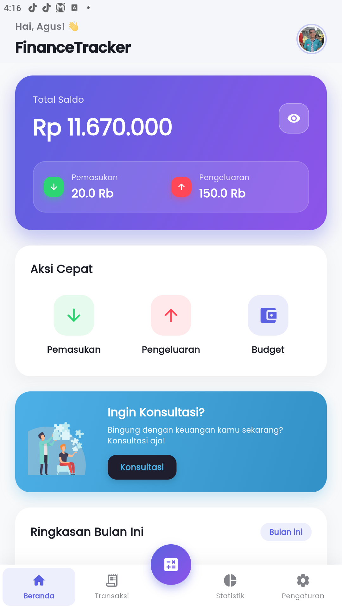
  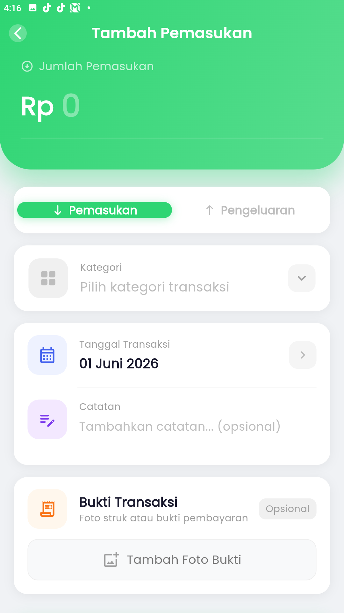
  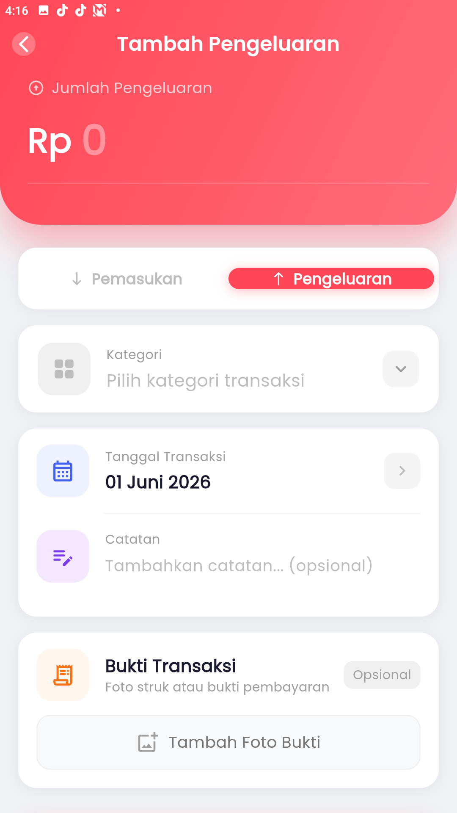
</div>
<div align="center">
  
  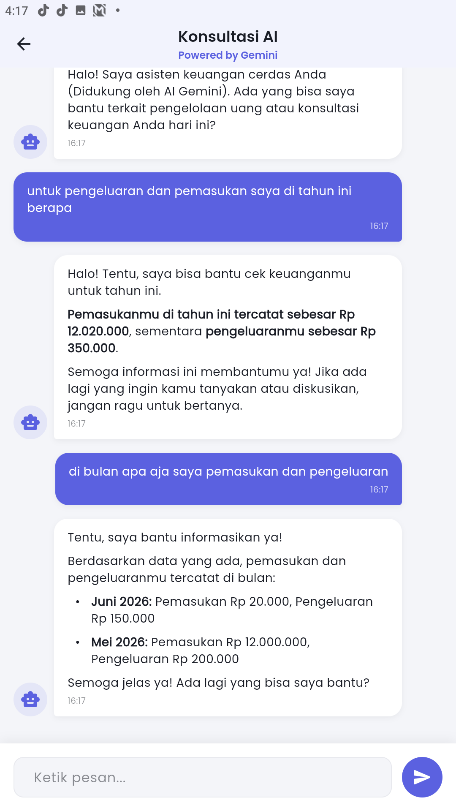
  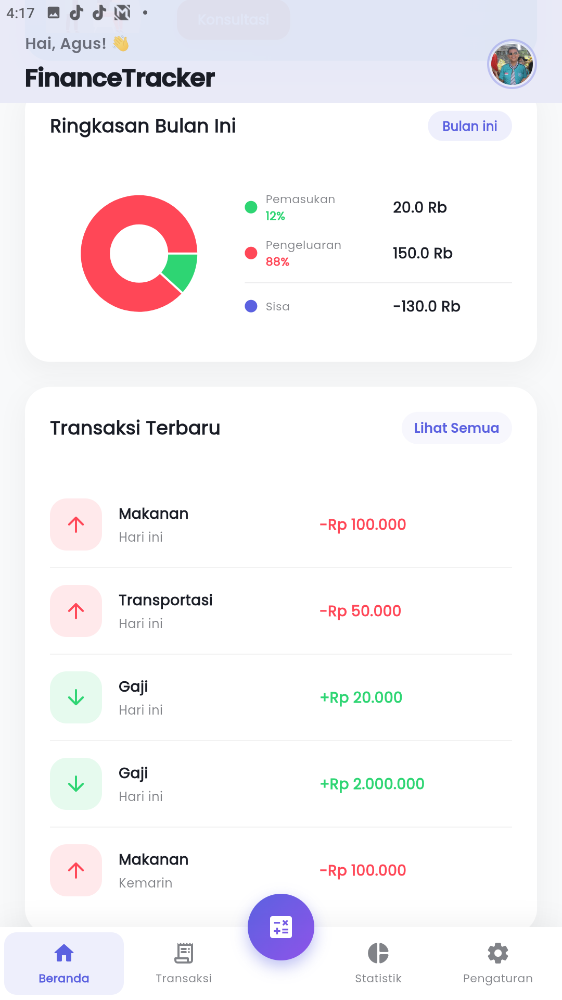
  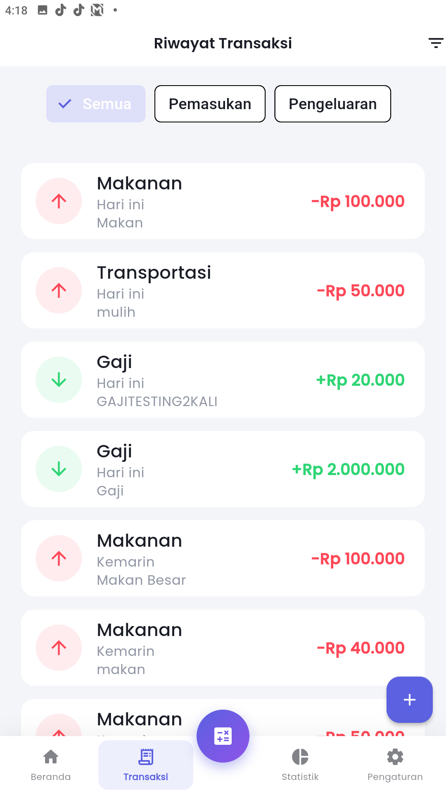
</div>
<div align="center">
  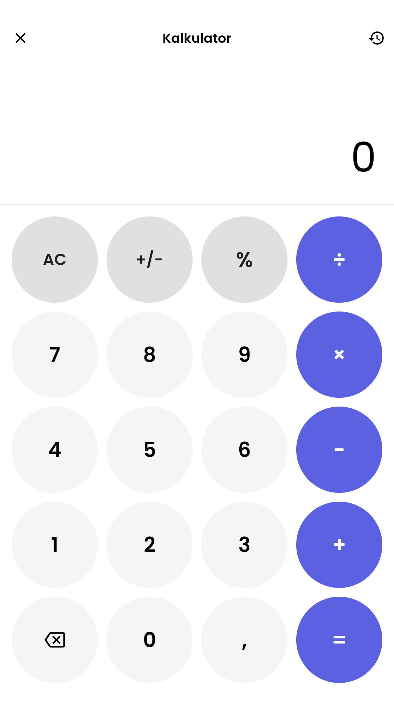
  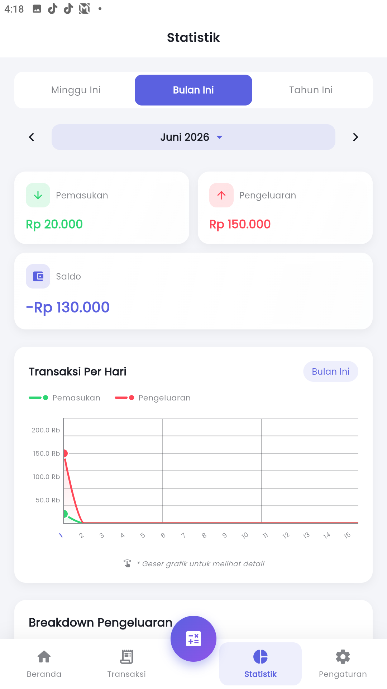
  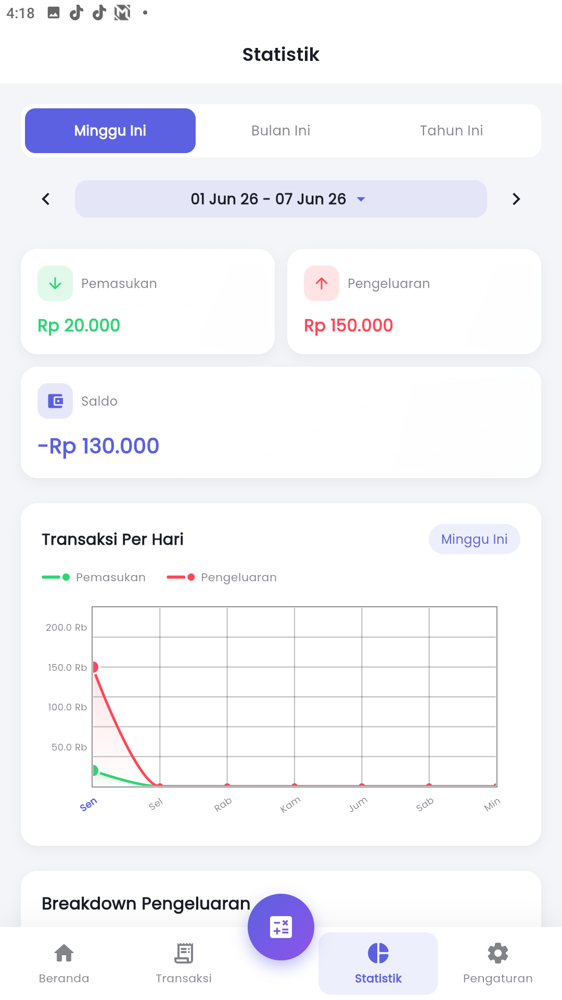
  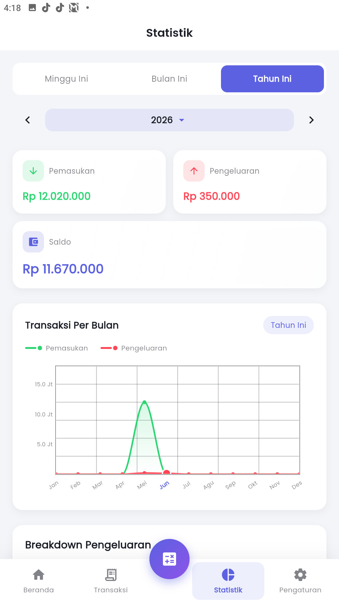
</div>
<div align="center">
  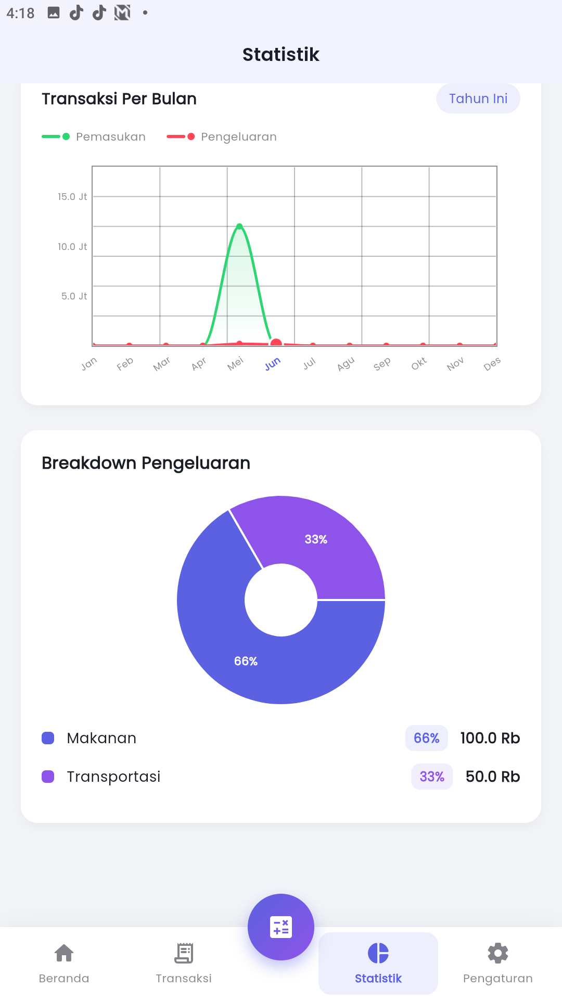
  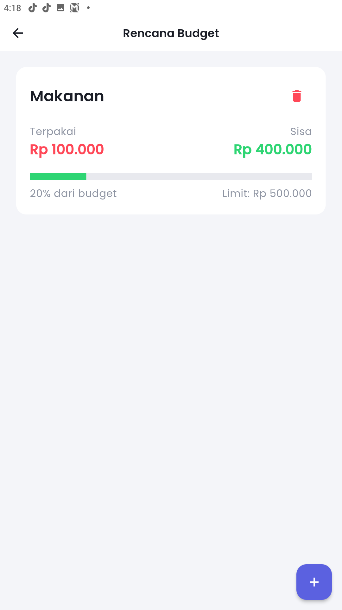
  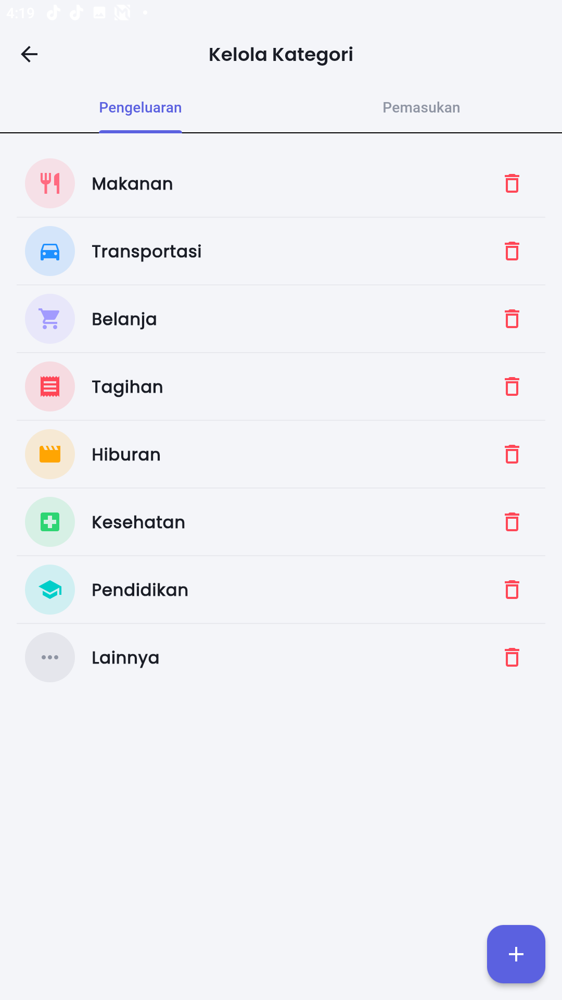
  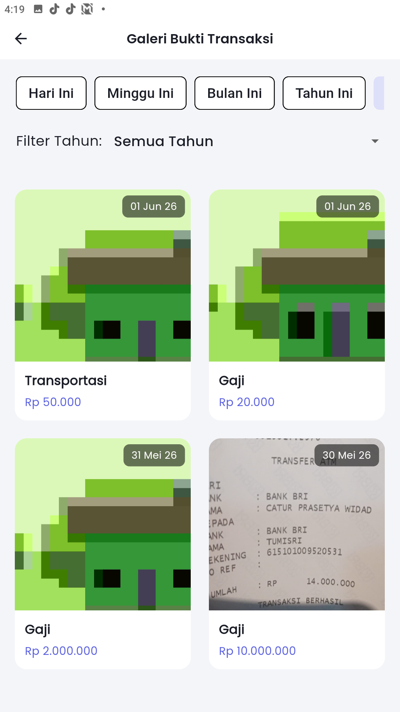
</div>
<div align="center">
  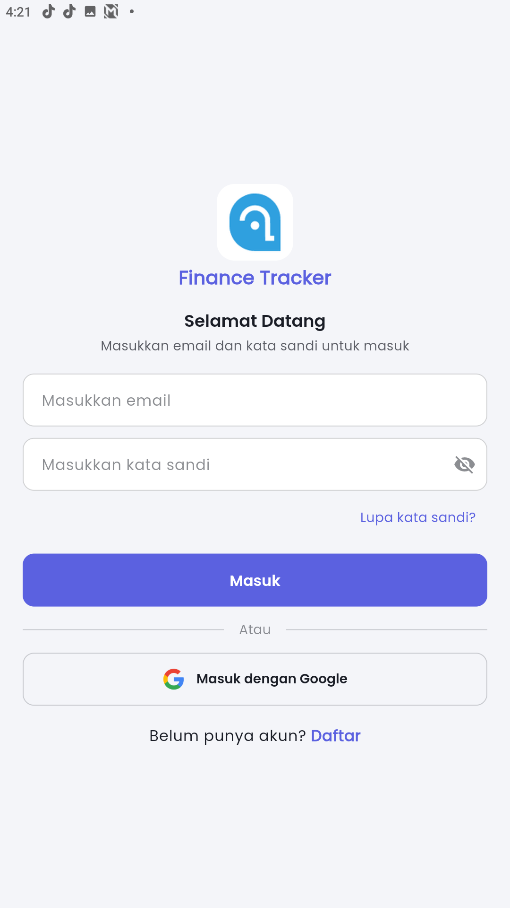
  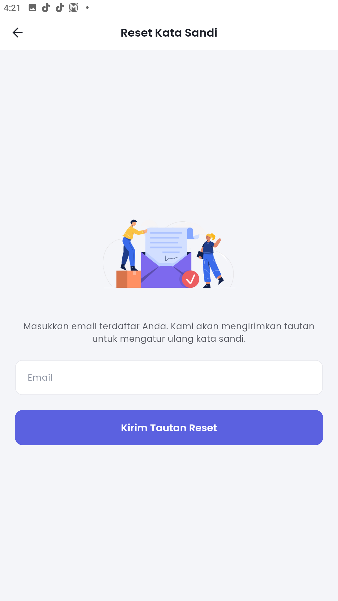
  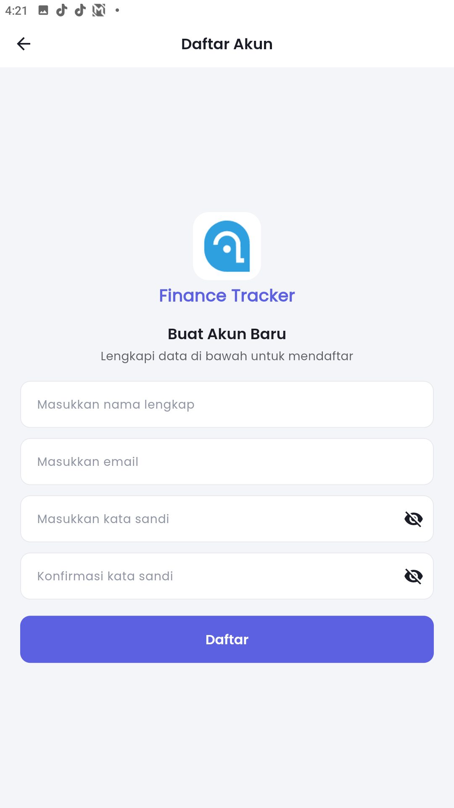
  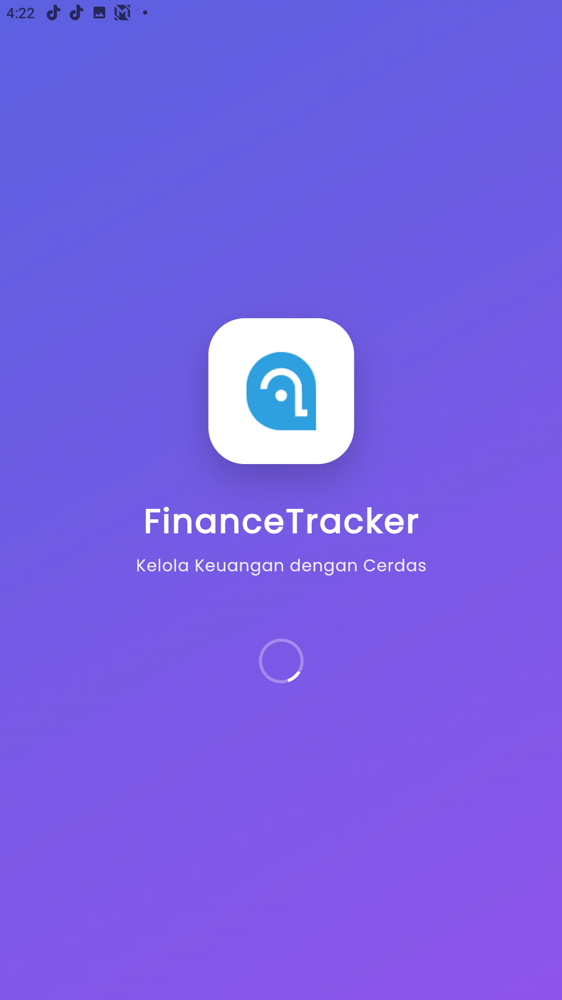
</div>

---

## 🎯 Fitur Utama

### 🔐 Autentikasi & Keamanan
- **Firebase Authentication**: Login dan Register menggunakan Email & Password
- **Google Sign-In**: Login cepat satu klik menggunakan akun Google
- **6-Digit PIN**: Keamanan lokal dengan verifikasi PIN 6 digit
- **Biometric Auth**: Dukungan sidik jari / Face ID (opsional)
- **Reset Password**: Lupa kata sandi via email Firebase
- **Session Management**: Auto-logout dan sesi aman

### ✅ Dashboard (Home)
- **Summary Saldo Total**: Tampilan saldo real-time dengan opsi hide/show
- **Grafik Pie Chart**: Visualisasi pemasukan vs pengeluaran bulan ini
- **Quick Action Buttons**: Akses cepat ke Pemasukan, Pengeluaran, dan Budget
- **Transaksi Terbaru**: 5 transaksi terakhir langsung di dashboard
- **Avatar Profil**: Foto profil di header, klik langsung ke Pengaturan
- **Responsive Layout**: Menyesuaikan otomatis untuk HP kecil, HP besar, tablet, dan desktop
- **Konsultasi Banner**: Akses cepat ke AI Consultant dari dashboard

### ✅ Transaksi
- **Form Input Transaksi**: Tambah pemasukan/pengeluaran dengan format Rupiah otomatis
- **Kategori Kustom**: Kelola kategori pemasukan dan pengeluaran sendiri
- **DatePicker**: Pilih tanggal transaksi (default: hari ini)
- **Catatan & Bukti Foto**: Lampirkan catatan dan foto bukti transaksi
- **Upload ke Cloud**: Foto bukti otomatis diupload ke Supabase Storage
- **Swipe to Delete**: Hapus transaksi dengan geser ke kiri
- **Filter & Pencarian**: Filter berdasarkan tipe (Semua/Pemasukan/Pengeluaran)

### ✅ Statistik & Laporan
- **Multi-Periode**: Analisis Harian, Mingguan, Bulanan, dan Tahunan
- **Bar Chart**: Perbandingan visual pemasukan vs pengeluaran
- **Pie Chart**: Breakdown pengeluaran per kategori
- **Top Kategori**: Ranking kategori pengeluaran terbesar

### ✅ Budget Planning
- **Budget per Kategori**: Tentukan batas pengeluaran per kategori per bulan
- **Progress Bar Visual**: Indikator visual sisa budget
- **Warning System**: Peringatan otomatis saat budget mencapai 80% dan 100%
- **Cloud Backup**: Budget otomatis di-backup ke Firebase Firestore

### 🤖 AI Financial Consultant (Gemini AI)
- **Powered by Gemini 2.5 Flash**: Konsultasi keuangan dengan AI Google terbaru
- **Konteks Data Real-time**: AI membaca data keuangan Anda untuk saran personal
- **Chat Interface**: UI chat modern dengan bubble dan markdown support
- **Saran Cerdas**: Tips berhemat, analisis pengeluaran, dan perencanaan keuangan

### 🧮 Kalkulator Keuangan
- **Desain ala iPhone**: UI kalkulator premium dengan tombol bulat
- **Operasi Lengkap**: Tambah, kurang, kali, bagi, persen, dan negasi
- **Format Angka Indonesia**: Titik sebagai pemisah ribuan, koma sebagai desimal
- **Riwayat Perhitungan**: Histori kalkulasi yang persistent
- **Auto-Resize Font**: Ukuran angka otomatis menyesuaikan panjang ekspresi

### 🖼️ Galeri Bukti Transaksi
- **Grid Gallery**: Tampilan grid 2 kolom untuk semua bukti transaksi
- **Multi-Filter**: Filter Hari Ini, Minggu Ini, Bulan Ini, Tahun Ini, Semua
- **Filter Tahun**: Dropdown untuk filter berdasarkan tahun spesifik
- **Full-Screen Viewer**: Lihat gambar full-screen dengan detail transaksi
- **Cloud & Local**: Mendukung gambar dari lokal dan URL cloud

### ☁️ Cloud Sync (Firebase + Supabase)
- **Firebase Firestore**: Sinkronisasi transaksi dan budget ke cloud
- **Supabase Storage**: Penyimpanan foto bukti transaksi dan profil
- **Document ID Deskriptif**: Prefix `pemasukan_` / `pengeluaran_` untuk organisasi data
- **Cross-Device**: Akses data dari perangkat manapun

### ✅ Pengaturan
- **Profil User**: Kelola nama dan foto profil (kamera/galeri/Google)
- **Dark/Light Mode**: Toggle tema gelap dan terang
- **Hide/Show Balance**: Sembunyikan atau tampilkan saldo di dashboard
- **Kelola Kategori**: Tambah, edit, dan hapus kategori kustom
- **Kelola Budget**: Manajemen budget per kategori
- **Ubah PIN**: Ganti PIN keamanan dengan verifikasi PIN lama
- **Logout**: Logout dari Firebase dan Google Sign-In

### ✅ UI/UX Premium
- **Gradient Design**: Purple-violet gradient yang elegan
- **Material Design 3**: Rounded corners dan elevasi modern
- **Responsive Design**: Adaptif untuk mobile, tablet, dan desktop
- **Smooth Animations**: Transisi dan micro-animation 60fps
- **Google Fonts (Poppins)**: Tipografi premium
- **Adaptive Layout**: Bottom Nav (mobile), Navigation Rail (tablet), Sidebar (desktop)

## 🛠️ Teknologi yang Digunakan

### Core Framework
- **Flutter** (SDK ^3.9.2) - Framework UI cross-platform
- **Dart** (^3.9) - Bahasa pemrograman

### State Management
- **Provider** (^6.1.2) - State management reactive

### Backend & Cloud
- **Firebase Auth** (^6.5.1) - Autentikasi pengguna (Email & Google)
- **Cloud Firestore** (^6.4.1) - Database cloud NoSQL
- **Firebase Storage** (^13.4.1) - Penyimpanan file cloud
- **Supabase** (^2.12.4) - Storage untuk foto bukti dan profil
- **Google Sign-In** (6.2.1) - OAuth login Google

### AI & Intelligence
- **google_generative_ai** (^0.4.7) - Gemini AI API
- **flutter_markdown** (^0.7.7+1) - Render markdown dari respons AI

### Database & Storage
- **SQLite / sqflite** (^2.3.3+2) - Database lokal
- **Shared Preferences** (^2.3.3) - Key-value storage untuk settings
- **path_provider** (^2.1.4) - Akses path sistem

### UI Components
- **fl_chart** (^0.68.0) - Grafik pie chart dan bar chart
- **flutter_slidable** (^3.1.1) - Swipe actions pada list
- **shimmer** (^3.0.0) - Loading skeleton premium
- **google_fonts** (^6.2.1) - Typography Poppins
- **flutter_svg** (^2.0.10+1) - Render ikon SVG
- **animations** (^2.0.11) - Animasi transisi halaman

### Utilities
- **intl** (^0.19.0) - Format currency Rupiah dan tanggal
- **image_picker** (^1.1.2) - Ambil foto dari kamera/galeri
- **local_auth** (^2.3.0) - Biometric authentication
- **math_expressions** (^3.1.0) - Parser kalkulasi matematika
- **flutter_dotenv** (^6.0.1) - Environment variable (.env)

## 📦 Instalasi

### Prasyarat
- Flutter SDK (^3.9.2)
- Android Studio / VS Code dengan Flutter extension
- Android SDK 21+ atau iOS 12+
- Firebase Project (untuk autentikasi & cloud sync)
- Supabase Project (untuk storage foto)
- Gemini API Key (untuk fitur AI Consultation)

### Langkah Instalasi

1. **Clone repository**
   ```bash
   git clone https://github.com/agussusanto7/Finance-Tracker.git
   cd Finance-Tracker
   ```

2. **Setup Environment Variables**
   ```bash
   # Buat file .env di root project
   cp .env.example .env
   ```
   Isi file `.env` dengan konfigurasi:
   ```env
   GEMINI_API_KEY=your_gemini_api_key_here
   SUPABASE_URL=your_supabase_url_here
   SUPABASE_ANON_KEY=your_supabase_anon_key_here
   ```

3. **Setup Firebase**
   - Buat project di [Firebase Console](https://console.firebase.google.com/)
   - Aktifkan Authentication (Email/Password & Google)
   - Aktifkan Cloud Firestore
   - Download `google-services.json` dan taruh di `android/app/`
   - Untuk iOS: download `GoogleService-Info.plist` dan taruh di `ios/Runner/`

4. **Setup Supabase Storage**
   - Buat project di [Supabase Dashboard](https://supabase.com/)
   - Buat bucket `receipts` dan `profiles` (public)
   - Salin URL dan Anon Key ke file `.env`

5. **Install dependencies**
   ```bash
   flutter pub get
   ```

6. **Generate Native Splash & Launcher Icons**
   ```bash
   dart run flutter_native_splash:create
   dart run flutter_launcher_icons
   ```

7. **Run aplikasi**
   ```bash
   # Development
   flutter run

   # Pilih device tertentu
   flutter devices
   flutter run -d <device-id>
   ```

8. **Build APK (untuk distribusi)**
   ```bash
   # Debug APK
   flutter build apk --debug

   # Release APK
   flutter build apk --release

   # App Bundle (untuk Play Store)
   flutter build appbundle --release
   ```

## 📂 Struktur Project

```
lib/
├── constants/
│   ├── app_constants.dart          # Konstanta (warna, ukuran, kategori)
│   └── app_theme.dart              # Konfigurasi tema (light & dark)
├── database/
│   └── database_helper.dart        # SQLite helper (CRUD lokal)
├── models/
│   ├── budget_model.dart           # Model data budget
│   ├── category_model.dart         # Model data kategori
│   ├── transaction_model.dart      # Model data transaksi
│   └── user_model.dart             # Model data pengguna
├── providers/
│   ├── budget_provider.dart        # State management budget
│   ├── category_provider.dart      # State management kategori
│   ├── theme_provider.dart         # State management tema
│   ├── transaction_provider.dart   # State management transaksi
│   └── user_provider.dart          # State management user & auth
├── services/
│   └── firebase_service.dart       # Firebase Firestore & Supabase Storage
├── screens/
│   ├── auth/
│   │   ├── login_screen.dart         # Login (Email & Google)
│   │   ├── register_screen.dart      # Registrasi akun baru
│   │   ├── reset_password_screen.dart # Reset kata sandi
│   │   ├── pin_screen.dart           # Verifikasi PIN login
│   │   └── pin_setup_screen.dart     # Setup PIN pertama kali
│   ├── budget/
│   │   └── budget_screen.dart        # Manajemen budget
│   ├── calculator/
│   │   └── calculator_screen.dart    # Kalkulator keuangan
│   ├── category/
│   │   └── category_screen.dart      # Kelola kategori kustom
│   ├── chat/
│   │   └── chat_screen.dart          # AI Consultant (Gemini)
│   ├── dashboard/
│   │   └── dashboard_screen.dart     # Dashboard utama
│   ├── gallery/
│   │   ├── gallery_screen.dart       # Galeri bukti transaksi
│   │   └── full_screen_image_screen.dart # Viewer gambar full-screen
│   ├── home/
│   │   └── main_screen.dart          # Layout adaptif & navigasi
│   ├── onboarding/
│   │   └── onboarding_screen.dart    # Onboarding pertama kali
│   ├── settings/
│   │   └── settings_screen.dart      # Halaman pengaturan
│   ├── splash_screen.dart            # Splash screen
│   ├── statistics/
│   │   └── statistics_screen.dart    # Statistik & laporan
│   └── transaction/
│       ├── add_transaction_screen.dart  # Form tambah transaksi
│       └── transaction_list_screen.dart # Daftar semua transaksi
├── utils/
│   ├── currency_formatter.dart     # Format mata uang Rupiah
│   └── date_formatter.dart         # Format tanggal Indonesia
└── main.dart                       # Entry point aplikasi
```

## 📝 Cara Penggunaan

### 1. Registrasi & Login
- Buka aplikasi → Halaman Login
- **Daftar baru**: Tap "Daftar" → Isi nama, email, dan kata sandi
- **Login Google**: Tap "Masuk dengan Google" untuk login cepat
- **Lupa kata sandi**: Tap "Lupa kata sandi?" → Masukkan email → Cek inbox
- Setelah login, setup **6-digit PIN** untuk keamanan lokal

### 2. Dashboard
- Lihat saldo total di card gradien atas
- Tap icon mata untuk hide/show saldo
- Gunakan Quick Action untuk tambah pemasukan/pengeluaran/budget
- Lihat Pie Chart ringkasan bulan ini
- Tap avatar profil (kanan atas) untuk langsung ke Pengaturan

### 3. Tambah Transaksi
- Tap Quick Action atau tombol + di bottom navigation
- Pilih tipe: Pemasukan/Pengeluaran
- Input nominal (format otomatis Rupiah)
- Pilih kategori → Set tanggal → Tambah catatan (opsional)
- Lampirkan foto bukti dari kamera/galeri (otomatis upload ke cloud)
- Tap "Simpan Transaksi"

### 4. Lihat Transaksi
- Tab "Transaksi" di bottom navigation
- Filter: Semua/Pemasukan/Pengeluaran
- Swipe kiri untuk delete

### 5. Statistik
- Tab "Statistik" di bottom navigation
- Pilih periode: Minggu Ini/Bulan Ini/Tahun Ini
- Lihat charts dan breakdown per kategori

### 6. Budget
- Dari Settings → Kelola Budget
- Tap tombol + untuk tambah budget
- Pilih kategori dan nominal limit
- Progress bar akan menunjukkan penggunaan

### 7. AI Consultation
- Dari dashboard, tap banner "Ingin Konsultasi?"
- Ketik pertanyaan keuangan Anda
- AI Gemini memberikan saran personal berdasarkan data keuangan Anda
- Contoh: "Bagaimana cara menghemat pengeluaran bulan ini?"

### 8. Kalkulator
- Tap tombol kalkulator (FAB di tengah bottom navigation)
- Gunakan untuk kalkulasi cepat sebelum input transaksi
- Riwayat perhitungan tersimpan selama sesi

### 9. Galeri Bukti
- Dari Settings → Galeri Bukti Transaksi
- Lihat semua foto bukti dalam tampilan grid
- Filter berdasarkan periode atau tahun
- Tap gambar untuk full-screen view

### 10. Settings
- Tap tab "Pengaturan" atau tap avatar di dashboard
- Edit profil dan nama
- Toggle dark mode / sembunyikan saldo / biometrik
- Kelola kategori kustom dan budget
- Ubah PIN keamanan

## 🔒 Keamanan

- **Cloud Auth**: Firebase Authentication (Email/Google OAuth)
- **Local Auth**: 6-digit PIN verification
- **Biometric**: Opsional fingerprint/face recognition
- **Data Isolation**: Firestore dengan UID-based isolation per user
- **Storage**: Supabase Storage dengan path per-user
- **Env Vars**: API keys tersimpan di `.env` (tidak di-commit ke repository)

## 🐛 Troubleshooting

### Issue: Database error
```bash
# Uninstall app dan install ulang
flutter clean
flutter pub get
flutter run
```

### Issue: Charts tidak muncul
- Pastikan package fl_chart terinstall: `flutter pub get`
- Restart aplikasi

### Issue: PIN lupa
- Uninstall aplikasi dan install ulang
- Semua data lokal akan hilang (data cloud tetap aman)

### Issue: Firebase error
- Pastikan `google-services.json` ada di `android/app/`
- Pastikan SHA-1/SHA-256 terdaftar di Firebase Console

### Issue: Gemini AI tidak merespons
- Cek API Key di file `.env`
- Pastikan koneksi internet aktif

### Issue: Foto tidak terupload
- Cek konfigurasi Supabase bucket (pastikan public access)
- Pastikan URL dan Anon Key di `.env` sudah benar

## 📄 Lisensi

Aplikasi ini dikembangkan untuk tujuan **edukasi** dan **penggunaan pribadi** sebagai bagian dari mata kuliah **Metode Penelitian** Semester 5.

## 👨‍💻 Developer

**Agus Susanto** — Mahasiswa Informatika

Dibuat dengan Flutter dan ❤️

---

## 📞 Support

Untuk pertanyaan atau issues, silakan buka issue di repository.

---

**FinanceTracker v1.0.0** — Smart Personal Finance Manager | Powered by Flutter, Firebase, Supabase & Gemini AI
